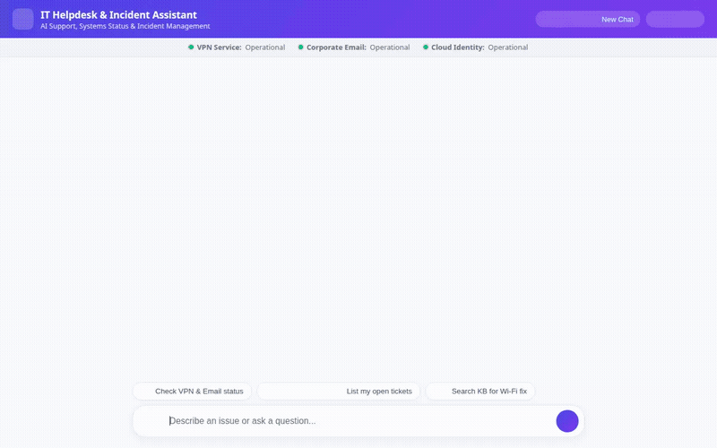

# IT Helpdesk & Incident Assistant Agent



An enterprise-grade **IT Helpdesk & Incident Assistant** built with the **Google Agent Development Kit (ADK)** framework and deployed to **Vertex AI Agent Runtime**. 

The assistant streamlines internal IT support by resolving service disruptions, managing support tickets in Google Cloud Firestore, generating equipment media via Imagen & Omni models, remembering user preferences and sensitivities via Vertex AI Memory Bank, and rendering interactive structured UI surfaces via Agent-to-User Interface (A2UI).

---

## 🌟 Core Features & Connected Services

All capabilities listed below are implemented and wired up in the codebase:

### 🧠 Vertex AI Memory Bank
* **Persistent Memory Service**: Integrates `VertexAiMemoryBankService` to store and retrieve long-term user context across sessions.
* **Context Preservation**: Remembers hardware preferences, dietary/chemical sensitivities, and personal facts from prior conversations (`PreloadMemoryTool`, `generate_memories_callback`).

### 🗄️ Google Cloud Firestore
* **Ticket Management**: Full lifecycle support for helpdesk tickets saved in Firestore (`tickets` collection) with lazy database client initialization.
* **Database Tools**:
  * `get_ticket`: Fetch ticket status and details by ticket ID.
  * `list_user_tickets`: List active tickets assigned to a specific user.
  * `create_ticket`: File a new IT support incident.
  * `update_ticket_status`: Update ticket status (e.g. `open`, `in_progress`, `resolved`).

### ☁️ Google Cloud Storage & Media Generation
* **Public Asset Storage**: Stores generated IT asset media in Google Cloud Storage (`it-helpdesk-assets-4aae627fbb97`).
* **Equipment Image Generation**: Uses Google's `gemini-3.1-flash-lite-image` model (`generate_equipment_image`) to generate high-resolution hardware visuals for documentation.
* **Equipment Video Generation**: Uses Google's Omni model (`gemini-omni-flash-preview`) in the `global` region (`generate_equipment_video`) via `client.interactions.create` to generate short video walkthroughs.
* **Artifact Integration**: Automatically registers generated files with `tool_context.save_artifact` for display in the Playground panel while streaming bytes directly to Cloud Storage.

### 💻 Secure Code Execution
* **Agent Engine Sandbox**: Executes custom Python scripts in an isolated, secure execution environment (`AgentEngineSandboxCodeExecutor`) for calculations and simulated data processing.

### 🎨 Agent-to-User Interface (A2UI v0.8)
* **Structured UI Cards**: Dynamically outputs raw JSON component trees (`Card`, `Column`, `Row`, `Text`, `Image`, `Video`) parsed by `a2ui_callback` for rich client rendering.

### 🛠️ Helpdesk & Diagnostic Tools
* **Service Status Check**: Real-time status inspection for corporate services (`VPN`, `Email`, `Cloud Identity`, `Single Sign-On`).
* **Knowledge Base Search**: Vector/keyword search across IT troubleshooting articles (`search_knowledge_base`).
* **Network IP Lookup**: Queries public IP and geo-location metadata (`lookup_network_ip`).
* **Google Maps Integration**: Geocodes corporate addresses (`geocode_address`) and finds nearby IT support hubs or hardware centers (`find_nearby_places`).

---

## 🏗️ Project Architecture

```
.
├── app/
│   ├── agent.py            # ADK Root Agent, tool definitions, Firestore & Memory Bank setup
│   └── a2ui_utils.py       # A2UI schema parsing and model callback handlers
├── frontend/
│   ├── main.py             # FastAPI backend proxying A2A requests to Agent Engine
│   └── static/
│       └── index.html      # Web client (Dark/Light mode, IT status banner, Voice input, A2UI renderer)
├── agents-cli-manifest.yaml # ADK Agent Runtime deployment manifest
├── deployment_metadata.json # Deployed Reasoning Engine resource metadata
├── project_brief.md        # Initial project specification
└── requirements.txt        # Python package dependencies
```

---

## 🚀 Setup & Local Execution

### Prerequisites

* Python 3.10+
* Google Cloud SDK (`gcloud`) authenticated with project access
* Vertex AI API & Firestore enabled on your GCP project

### 1. Install Dependencies

```bash
pip install -r requirements.txt
```

### 2. Set Environment Variables

```bash
export AGENT_ENGINE_RESOURCE_NAME="projects/<PROJECT_NUMBER>/locations/us-east1/reasoningEngines/<REASONING_ENGINE_ID>"
export AGENT_DIRECTORY="app"
export PORT=8080
```

### 3. Run the Local Web Server

```bash
python main.py
```

Open your browser to the local server port printed in the terminal (default: `http://localhost:8080`).

---

## ☁️ Deployment

### Deploy Agent to Vertex AI Agent Runtime

Deploy the ADK agent to Vertex AI Agent Runtime using `agents-cli`:

```bash
agents-cli deploy --no-confirm-project --project <YOUR_GCP_PROJECT_ID>
```

### Deploy Frontend to Cloud Run

Deploy the FastAPI frontend proxy to Google Cloud Run:

```bash
gcloud run deploy it-helpdesk-frontend \
  --source ./frontend \
  --region us-east1 \
  --allow-unauthenticated \
  --set-env-vars AGENT_ENGINE_RESOURCE_NAME="<YOUR_REASONING_ENGINE_RESOURCE_NAME>",AGENT_DIRECTORY="app"
```

Grant the Cloud Run service account permission to invoke the reasoning engine:

```bash
gcloud projects add-iam-policy-binding <YOUR_GCP_PROJECT_ID> \
  --member="serviceAccount:<PROJECT_NUMBER>-compute@developer.gserviceaccount.com" \
  --role="roles/aiplatform.user"
```

---

## 📄 License

Copyright 2026 Google LLC. Licensed under the Apache License, Version 2.0.
